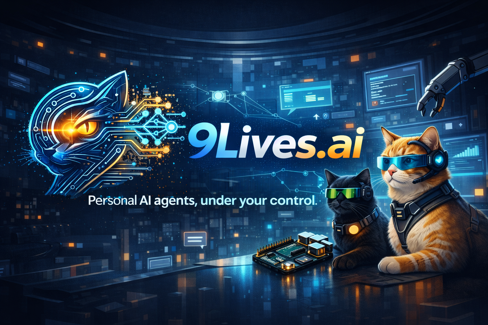
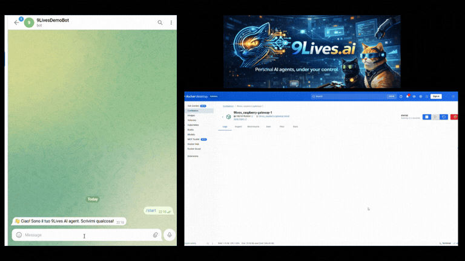

<p align="center">
  
</p>

# 9Lives
🚀 **Personal AI agents, under your control.**

9Lives is a **local-first runtime for AI agents** that lets you run autonomous agents on your own infrastructure.

Run your agents on:

- Raspberry Pi
- Personal computers
- Private servers
- Home labs

Create **Lives (agents)**, give them **Skills (tools)**, and orchestrate them with **Crews**.

---

<h2 align="center">🎬 Demo</h2>
<h3 align="center">Control your AI agents from Telegram.</h3>

<p align="center">
  
</p>


User → Telegram  
↓  
9Lives  
↓  
AI agent executes workflow  
↓  
Email / task / report  

Example use case:

Morning briefing agent that gathers news and sends you a daily report.

---

# Why 9Lives

Most AI agent frameworks today are:

- cloud dependent  
- difficult to control  
- unpredictable in production  

9Lives focuses on:

- **local-first execution**  
- **controllable agents**  
- **deterministic workflows**  
- **multi-agent orchestration**  

---

# Core Concepts

## Lives

A **Live** is an AI agent with its own identity, memory and capabilities.

---

## Skills

Skills extend what a Live can do.  
They are simple **TypeScript functions**.

---

## Crews

A **Crew** is a team of Lives working together.

---

## Lanes

A **Lane** defines how work is executed.

---

## Memory

Each Live maintains its own contextual memory.

---

## Guardrails

Define safety boundaries for agent execution.

---

# Quick Start

```bash
git clone https://github.com/yourusername/9lives
cd 9lives
docker compose up
```

Open:

http://localhost:3000

---

# Running on Raspberry Pi

Recommended:

- Raspberry Pi 5  
- 8GB RAM  
- Docker  

---

# Architecture

User Interfaces  
↓  
Lane Queue  
↓  
Crew Orchestrator  
↓  
Lives  
↓  
Skills  

---
## 📚 Documentation

Explore the full technical documentation:

- 📖 [Technical Guide](docs/technical_guide.MD) — complete overview of architecture, concepts, and setup
  
# Roadmap

## v0.1
- core runtime  
- Lives  
- Skills  
- Crews  
- Lanes  
- scheduler  

## v0.2
- dynamic skill loading  
- plugin system  

## v0.3
- skill registry  
- monitoring  

---

# Contributing

Contributions are welcome!

---

# License

Copyright (c) 2026 Flavio Cerato


Licensed under the Apache License, Version 2.0 (the "License");
you may not use this file except in compliance with the License.

---

# Vision

Run your own AI agents. Locally. Under your control.
